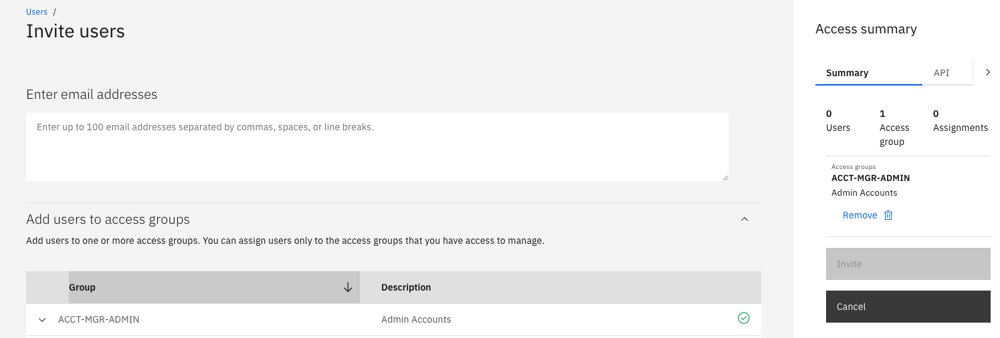

# IBM Terraform configurations for IBM Cloud Identity and Access Management (IAM)

This repository contains a collection of Terraform configurations for configuring IBM Cloud accounts using [Identity and Access Management](https://cloud.ibm.com/docs/account?topic=account-userroles) (IAM).

## Configurations

| Name | Description |
| ---------------- | ---------------- |
| [acctmgrs](https://github.com/ibm-pett/acct-config-iam/tree/master/acctmgrs) | Create an access group for account management and add users to make them account managers. |
| [invite-users](https://github.com/ibm-pett/acct-config-iam/tree/master/acctmgrs/invite-users) | Add users to the account. Also give them all Classic Infrastructure permissions. |
| [acctmgrgroup](https://github.com/ibm-pett/acct-config-iam/tree/master/acctmgrs/acctmgrgroup) | Create an access group with policies to manage the account and all resources in it. |
| | |
| [randagroups](https://github.com/ibm-pett/acct-config-iam/tree/master/randagroups) | Create a resource group and access groups for controlling access to an environment. |
| [rgroups](https://github.com/ibm-pett/acct-config-iam/tree/master/randagroups/rgroups) | Create a resource group for an environment. |
| [agroups](https://github.com/ibm-pett/acct-config-iam/tree/master/randagroups/agroups) | Create the access groups to use a resource group. |

## Run from a schematics workspace

1. Create a *schematics* workspace on your local cloud account
2. List https://github.com/ibm-hcbt/acct-config-iam/randagroups under "GitHub, GitLab or Bitbucket repository URL"
3. Leave git access token blank since this is a public repo
4. Change terraform version to 0.12
5. Save workspace settings
5. Enter resource group and access group names in workspae options.
6. Click "Save Changes" a couple times
7. Select "Generate Plan" option at top right of page, when that finishes
8. Select "Apply Plan" option at top right of page
9. Verify that your resource group has been created by going to the "Manage", "Account", "Resource Groups" page
10. Verify that your access groups have been created by going to the "Manage", "Access (IAM)", "Access groups" page

## Run from local Terraform client

#### 1. Make sure Terraform is properly installed on your system see [Terraform Installation Instructions](https://ibm.github.io/cloud-enterprise-examples/iac/setup-environment/#install-terraform): 

#### 2. Create an IBM Cloud API Key
```
ibmcloud login --sso
ibmcloud resource groups
ibmcloud target -g RESOURCE_GROUP_NAME

ibmcloud iam api-key-create TerraformKey -d "API Key for Terraform" --file ~/.ibm_api_key.json

export IC_API_KEY=$(grep '"apikey":' ~/.ibm_api_key.json | sed 's/.*: "\(.*\)".*/\1/')
```
#### 3. Create an IBM Cloud Classic Infrastructure API Key
refer to [Managing classic infrastructure API keys](https://cloud.ibm.com/docs/account?topic=account-classic_keys). Ensure you create the key for the account you are setting up. 

#### 4. Set environment variables

Either export these variables or update the credentials.sh.template file to include

```bash
export IAAS_CLASSIC_USERNAME="< Your IBM Cloud Username/Email here >"
export IAAS_CLASSIC_API_KEY="< Your IBM Cloud Classic API Key here >"
export IC_API_KEY="< IBM Cloud API Key >"
```

If you updated credentials.sh.template, rename it to credentials.sh and execute:

```bash
source ./credentials.sh
```

#### 5. Install these configurations using the standard Terraform process

- From a command line, change to the configuration's directory
- Modify the `terraform.tfvars` file
- Run `terraform init` to initialize Terraform
- Run `terraform apply` to install the configuration

## Steps to set up a Cloud Pak Sandbox account

### Account Owner -

1. Create IBM Cloud Account

2. Create the access group for Account Managers

    Run scripts from `https://github.com/ibm-pett/acct-config-iam/tree/main/acctmgrs` either using Schematics or local Terraform client. If using schematics, create and apply a new workspace in the `Default` resource group.

    Once run, the `ACCT-MGR-ADMIN` access group with the following roles will be created:
    

3. Add Account Manager Users by assigning to ACCT-MGR-ADMIN access group:

    

4. Add IaaS permisions to at least one Account Manager so that Kubernetes service in IAM can work

    
    

### Account Manager -

Make sure you are logged in to proper cloud account:

```bash
ibmcloud login -sso
```
1. Create a `schematics.json` file with the following:

   ```json
   {
     "name": "schematics IAM setup",
     "type": [
       "terraform_v0.12"
     ],
     "description": "IBM Cloud Schematics Workspace to create schematics rg and ag",
     "tags": [
       "owner:$USER"
     ],
     "resource_group": "Default",
     "template_repo": {
       "url": "https://github.com/ibm-hcbt/acct-config-iam/tree/main/randagroups",
       "branch": "main"
     },
     "template_data": [
       {
         "folder": ".",
         "type": "terraform_v0.12",
         "variablestore": [
           {
             "name": "resource_group_name",
             "value": "schematics",
             "type": "string"
           },
           {
             "name": "admins_access_group_name",
             "value": "SCHEMATICS-ADMIN",
             "type": "string"
           },
           {
             "name": "users_access_group_name",
             "value": "SCHEMATICS-USER",
             "type": "string"
           },
           {
             "name": "sat_access_group_name",
             "value": "SCHEMATICS-SAT-ADMIN",
             "type": "string"
           }
         ]
       }
     ]
   }
   ```

2. To set up the schematicsresource and access groups, run

   ```bash
   ./setup_account.sh schematics
   ```

    The `SCHEMATICS-ADMIN`, `SCHEMATICS-USER`, and `SCHEMATICS-SAT-ADMIN` access groups will be created 
    
3. Create a `cloud-pak-sandbox.json` file with the following:

   ```json
   {
     "name": "cloud-pak-sandbox IAM setup",
     "type": [
       "terraform_v0.12"
     ],
     "description": "IBM Cloud Schematics Workspace to create cloud-pak-sandbox rg and ag",
     "tags": [
       "owner:$USER"
     ],
     "resource_group": "schematics",
     "template_repo": {
       "url": "https://github.com/ibm-hcbt/acct-config-iam/tree/main/randagroups",
       "branch": "main"
     },
     "template_data": [
       {
         "folder": ".",
         "type": "terraform_v0.12",
         "variablestore": [
           {
             "name": "resource_group_name",
             "value": "cloud-pak-sandbox",
             "type": "string"
           },
           {
             "name": "admins_access_group_name",
             "value": "CLOUD-PAK-SANDBOX-ADMIN",
             "type": "string"
           },
           {
             "name": "users_access_group_name",
             "value": "CLOUD-PAK-SANDBOX-USER",
             "type": "string"
           },
           {
             "name": "sat_access_group_name",
             "value": "CLOUD-PAK-SANDBOX-SAT-ADMIN",
             "type": "string"
           }
         ]
       }
     ]
   }
   ```

4. To set up the cloud-pak-sandbox resource and access groups, run

   ```bash
   ./setup_account.sh cloud-pak-sandbox
   ```

    The `CLOUD-PAK-SANDBOX-ADMIN`, `CLOUD-PAK-SANDBOX-USER`, and `CLOUD-PAK-SANDBOX-SAT-ADMIN` access groups will be created 

5. The Account Manager that has Classic Infrastructure permissions needs to create Classic Infrastructure Keys:

    ```bash
   ibmcloud login -sso
   ibmcloud target -g <resource-group>
   ibmcloud regions
   ibmcloud ks api-key reset --region <region>
    ```

    Repeat these steps for each region and resource group that needs Classic Infrastructure permissions

    To see status of api key for a cluster:

    ```bash
    ibmcloud ks api-key info --cluster <cluster_name_or_ID>
    ```

5. Add users to the access groups

    - A user who needs to create or configure OpenShift clusters needs to belong to `CLOUD-PAK-SANDBOX-ADMIN`

    - A user who just needs cluster admin privileges needs to belong to `CLOUD-PAK-SANDBOX-USER`

    - Users that need additional privileges to manage Cloud Satellite need to belong to `CLOUD-PAK-SANDBOX-SAT-ADMIN`

6. Give support ticket access to ADMIN users:

    Add Access Groups: **Add cases and view orders**, **Edit cases**, and **View cases**.

    If those access groups aren't available, try these commands (from https://cloud.ibm.com/docs/containers?topic=containers-access_reference#infra):

    ```bash
        ibmcloud sl user list
        ibmcloud sl user permission-edit <user_id> --permission TICKET_ADD --enable true
        ibmcloud sl user permission-edit <user_id> --permission TICKET_EDIT --enable true
        ibmcloud sl user permission-edit <user_id> --permission TICKET_VIEW --enable true
    ```

    NOTE: either account owner needs to do this or parent needs to have these permissions already.

    In addition, try the steps [here](https://cloud.ibm.com/docs/openshift?topic=openshift-cs_troubleshoot_clusters#cs_totp)

7. Enable [VRF](https://cloud.ibm.com/docs/account?topic=account-vrf-service-endpoint) on the account (Optional)

    

