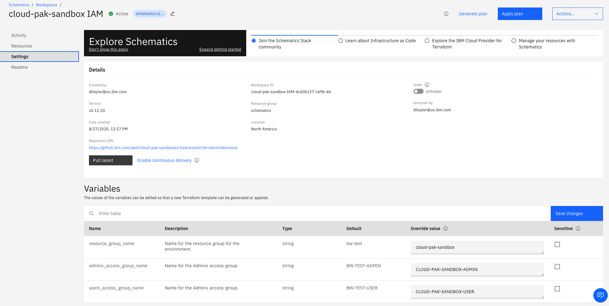
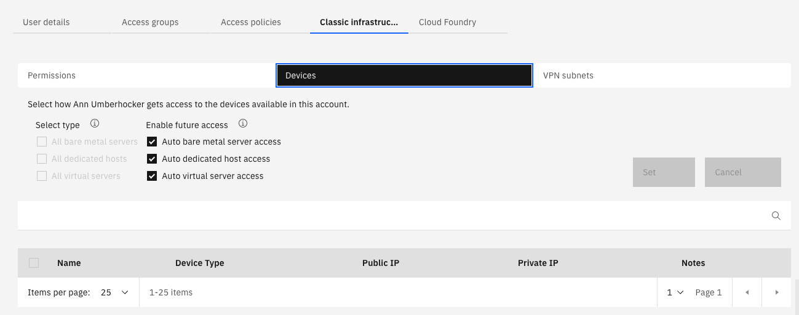

# IBM Terraform configurations for IBM Cloud Identity and Access Management (IAM)

This repository contains a collection of Terraform configurations for configuring IBM Cloud accounts using [Identity and Access Management](https://cloud.ibm.com/docs/account?topic=account-userroles) (IAM).

## Configurations

| Name | Description |
| ---------------- | ---------------- |
| [acctmgrs](https://github.com/ibm-pett/acct-config-iam/tree/master/acctmgrs) | Create an access group for account management and add users to make them account managers. |
| [invite-users](https://github.com/ibm-pett/acct-config-iam/tree/master/acctmgrs/invite-users) | Add users to the account. Also give them all Classic Infrastructure permissions. |
| [acctmgrgroup](https://github.com/ibm-pett/acct-config-iam/tree/master/acctmgrs/acctmgrgroup) | Create an access group with policies to manage the account and all resources in it. |
| | |
| [randagroups](https://github.com/ibm-pett/acct-config-iam/tree/master/randagroups) | Create a resource group and access groups for controlling access to an environment. |
| [rgroups](https://github.com/ibm-pett/acct-config-iam/tree/master/randagroups/rgroups) | Create a resource group for an environment. |
| [agroups](https://github.com/ibm-pett/acct-config-iam/tree/master/randagroups/agroups) | Create the access groups to use a resource group. |


## Run from a schematics workspace
1. Create a *schematics* workspace on your local cloud account
2. List https://github.com/ibm-hcbt/acct-config-iam/randagroups under "GitHub, GitLab or Bitbucket repository URL"
3. Leave git access token blank since this is a public repo
4. Change terraform version to 0.12
5. Save workspace settings
5. Enter resource group and access group names in workspae options.
6. Click "Save Changes" a couple times
7. Select "Generate Plan" option at top right of page, when that finishes
8. Select "Apply Plan" option at top right of page
9. Verify that your resource group has been created by going to the "Manage", "Account", "Resource Groups" page
10. Verify that your access groups have been created by going to the "Manage", "Access (IAM)", "Access groups" page

## Run from local Terraform client

#### 1. Make sure Terraform is properly installed on your system see [Terraform Installation Instructions](https://ibm.github.io/cloud-enterprise-examples/iac/setup-environment/#install-terraform): 

#### 2. Create an IBM Cloud API Key
```
ibmcloud login --sso
ibmcloud resource groups
ibmcloud target -g RESOURCE_GROUP_NAME

ibmcloud iam api-key-create TerraformKey -d "API Key for Terraform" --file ~/.ibm_api_key.json

export IC_API_KEY=$(grep '"apikey":' ~/.ibm_api_key.json | sed 's/.*: "\(.*\)".*/\1/')
```
#### 3. Create an IBM Cloud Classic Infrastructure API Key
refer to [Managing classic infrastructure API keys](https://cloud.ibm.com/docs/account?topic=account-classic_keys). Ensure you create the key for the account you are setting up. 

#### 4. Set environment variables

Either export these variables or update the credentials.sh.template file to include
```
export IAAS_CLASSIC_USERNAME="< Your IBM Cloud Username/Email here >"
export IAAS_CLASSIC_API_KEY="< Your IBM Cloud Classic API Key here >"
export IC_API_KEY="< IBM Cloud API Key >"
```
If you updated credentials.sh.template, rename it to credentials.sh and execute:
```
source ./credentials.sh
```

#### 5. Install these configurations using the standard Terraform process:
- From a command line, change to the configuration's directory
- Modify the `terraform.tfvars` file
- Run `terraform init` to initialize Terraform
- Run `terraform apply` to install the configuration

## Steps to set up an account

1. Account is created

2. Create the access group for Account Managers and users
    - Run scripts from `https://github.com/ibm-pett/acct-config-iam/tree/main/acctmgrs` either using Schematics or local Terraform client. If using schematics, create and apply a new workspace in the `Default` resource group.

Once run, the ACCT-MGR access group with the following roles will be created:


3. Create an environment (resource group and access group) for Schematics workspaces 
    - If using schematics, create a new schematics workspace in the `Default` resource group.
    
    - Save these settings for the workspace
    
    - Name the resource group `schematics` and the access groups `SCHEMATICS-ADMIN`, and `SCHEMATICS-USER` under variables section
    
    - Click "Save Changes" a couple times
    - Select "Generate Plan" and "Apply Plan"

Once run, the SCHEMATICS-ADMIN access group will be create with the following roles: 


4. Create an environment (resource group and access group) for Cloud Pak sandboxes
    - Using schematics, create a new workspace in the `schematics` resource group.
    
    - Save these settings for the workspace
    
    - Name the resource group `cloud-pak-sandbox` and the access groups `CLOUD-PAK-SANDBOX-ADMIN`, and `CLOUD-PAK-SANDBOX-USER`
    
    - Click "Save Changes" a couple times
    - Select "Generate Plan" and "Apply Plan"
        
Once run, the CLOUD-PAK-SANDBOX-ADMIN access group will be create with the following roles: 


The CLOUD-PAK-SANDBOX-USER access group will be create with the following roles: 


8. Add IaaS permisions for admin so that Kubernetes service in IAM can work

    Set Infrastructure access
    
    
    
    Admin that has Classic Infrastructure permissions needs to create Classic Infrastructure Keys:
    ```
        ibmcloud login -sso
        ibmcloud target -g <resource-group>
        ibmcloud regions
        ibmcloud ks api-key reset --region <region>
    ```
    Repeat these steps for each region and resource group that needs Classic Infrastructure permissions
    
    
    To see status of api key for a cluster:
    ```
    ibmcloud ks api-key info --cluster <cluster_name_or_ID>
    ```
 5. Add users to the access groups
    - A user who will run the script to create a Cloud Pak sandbox needs to belong to both `SCHEMATICS-ADMIN` (to run the workspace in `schematics`) and to `CLOUD-PAK-SANDBOX-ADMIN` (so that the script can install the sandbox in `cloud-pak-sandbox`)
    - A user who needs to create or configure OpenShift clusters needs to belong to `CLOUD-PAK-SANDBOX-ADMIN`
    - A user who uses a sandbox once it's installed needs to belong to `CLOUD-PAK-SANDBOX-USER`
        
7. Give support ticket access to ADMIN users:
    
    Add Access Groups: **Add cases and view orders**, **Edit cases**, and **View cases**.
    
    If those access groups aren't available, try these commands (from https://cloud.ibm.com/docs/containers?topic=containers-access_reference#infra): 
    ```
        ibmcloud sl user list
        ibmcloud sl user permission-edit <user_id> --permission TICKET_ADD --enable true
        ibmcloud sl user permission-edit <user_id> --permission TICKET_EDIT --enable true
        ibmcloud sl user permission-edit <user_id> --permission TICKET_VIEW --enable true
    ```
    NOTE: either account owner needs to do this or parent needs to have these permissions already.
    
    In addition, try the steps [here](https://cloud.ibm.com/docs/openshift?topic=openshift-cs_troubleshoot_clusters#cs_totp)
    
8. Enable [VRF](https://cloud.ibm.com/docs/account?topic=account-vrf-service-endpoint) on the account (Optional)

    
    
    

