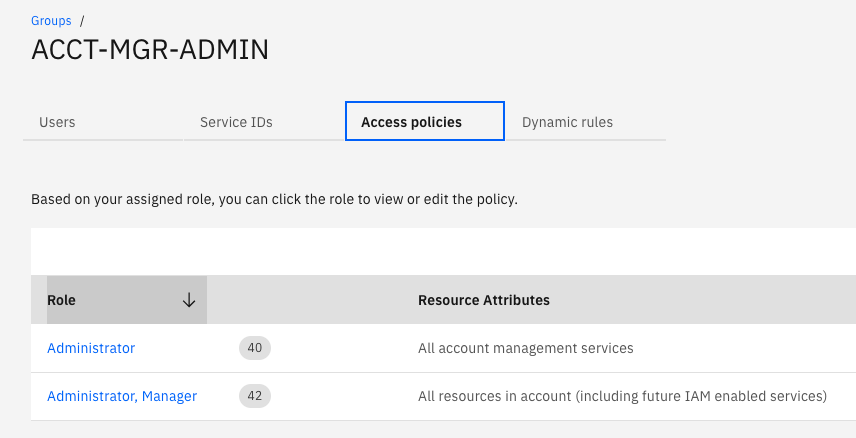
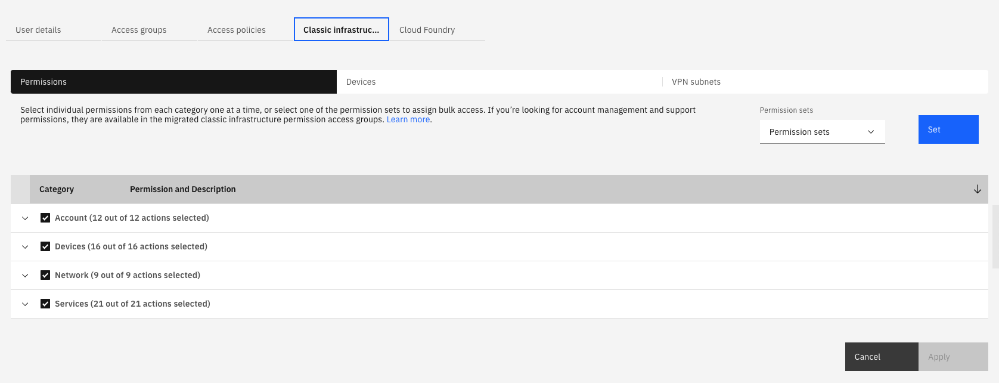
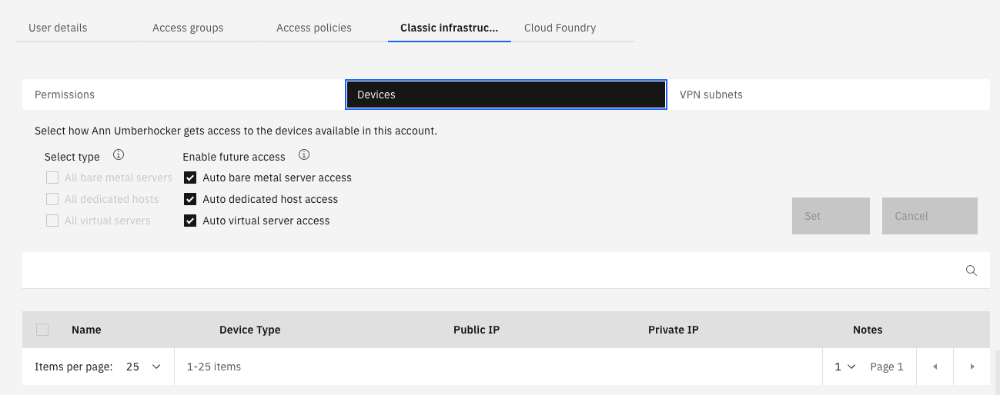
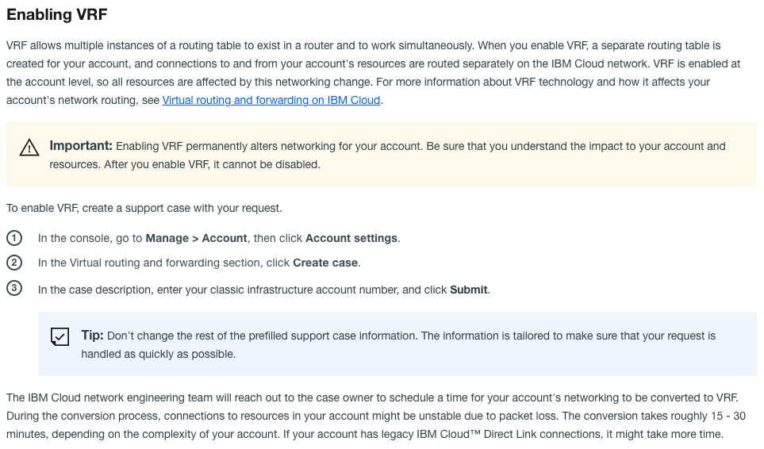

# Steps to set up a Partner Sandbox account

Clone this repo and cd into `acct-config-iam`

## Account Owner Tasks

1. Create IBM Cloud Account for partner

2. Create the access group and users for Account Managers

    - Uncomment and add list of Account Manager users to this [terraform.tfvars](../examples/acctmgrs/terraform.tfvars) file
    
    - Run scripts from `https://github.com/ibm-hcbt/acct-config-iam/tree/main/examples/acctmgrs` either using [Schematics](./examples/README.md#run-from-a-schematics-workspace) or local [Terraform](./examples/README.md#run-from-local-terraform-client) client. If using schematics, create and apply new workspace in the `Default` resource group.

    Once run, the `ACCT-MGR-ADMIN` access group with the following roles will be created:
    

3. Add IaaS permisions to at least one Account Manager user so that Kubernetes service in IAM can work

    
    

## Account Manager Tasks

Make sure you are logged in to proper cloud account:

```bash
ibmcloud login -sso
```

1. To initially set up the account run:

   ```bash
   # We typically call the first resource group partner-sandbox
   cp templates/test.json templates/<resource-group>.json        
   ```
   
   Edit the <resource-group>.json to replace `test` resource group with new resource group name.  Also replace `TEST` with new resource group name (using uppercase).
    
   ```bash
   cd utils
   ./setup_account.sh partner-sandbox
   ```

   This will start a schematics workspace that will create:
   - the new resource group
   - a service id called `partner-sandbox-admin-id`
   - the `-ADMIN`, `-USER`, `-SERVICEID` and `SAT-ADMIN` access groups for the new resource group

2. **Optional:** Create additional resource and access groups for other projects within the account:

   ```bash
   cp templates/test.json templates/<new resource group>.json
   ```

   Make sure that this new template points to the [partner-sandbox-randagroups](https://github.com/ibm-hcbt/acct-config-iam/tree/main/examples/partner-sandbox-randagroups) repo for its source and replace the names of the access groups. Replace `test` and `TEST` to new resource and access group names.
   
   To create the resource and access groups do the following:
   ```bash
   cd utils
   ./setup_account.sh <new resource group>
   ```    
3. Create an API key for Classic Infrastructure permissions. This only needs to be done for one valid user on the account that has full infrastructure permissions. **NOTE:** If user is removed from the account, this will have to be repeated for new valid user:

   - create a `<classic_infra_api_key>`, go [here](https://github.com/ibm-hcbt/cloud-pak-sandboxes/blob/master/terraform/CREDENTIALS.md#create-an-ibm-cloud-classic-infrastructure-api-key) for instructions

   - get `<username>` by running `ibmcloud sl user list` on the account
    
   - set ks credentials for all needed regions

   ```bash
   ibmcloud ks credential set classic --infrastructure-api-key <classic_infra_api_key> --infrastructure-username <username> --region <region>
   ```
    
4. Create Service ID and api keys:
   
   ```bash
   export SERVICEID_API_KEY=$(ibmcloud iam service-api-key-create partner-sandbox-api-key partner-sandbox-admin-id --file serviceid-api-key.json -d "API key for partner sandbox service ID"| awk '/API Key/{print $3}')
   ibmcloud login --apikey $SERVICEID_API_KEY -g partner-sandbox
   ibmcloud ks api-key reset --region <region>
   ```
    
   To add api-keys for additional regions and resource groups, execute the command 
   ```bash
   ibmcloud target -g <resource_group>
   ibmcloud ks api-key reset --region <new_region>
   ```

   **IMPORTANT:** Make a note of the Service id IAM API key. This will be saved in `serviceid-api-key.json` file
   
5. Add users to the access groups

   External users need to register for cloud accounts [here](https://cloud.ibm.com/registration)

    - A user who needs to create or configure OpenShift clusters needs to belong to `-ADMIN`

    - A user who just needs cluster admin privileges needs to belong to `-USER`

    - Users that need additional privileges to manage Cloud Satellite need to belong to `-SAT-ADMIN`

6. Give support ticket access to ADMIN users:

    Add Access Groups: **Add cases and view orders**, **Edit cases**, and **View cases**.

    If those access groups aren't available, try [these](https://cloud.ibm.com/docs/containers?topic=containers-access_reference#infra) commands:

    ```bash
    ibmcloud sl user list
    ibmcloud sl user permission-edit <user_id> --permission TICKET_ADD --enable true
    ibmcloud sl user permission-edit <user_id> --permission TICKET_EDIT --enable true
    ibmcloud sl user permission-edit <user_id> --permission TICKET_VIEW --enable true
    ```

    NOTE: either account owner needs to do this or parent needs to have these permissions already.

    In addition, try the steps [here](https://cloud.ibm.com/docs/openshift?topic=openshift-cs_troubleshoot_clusters#cs_totp)

6. **Optional** If partner wants to enable [VRF](https://cloud.ibm.com/docs/account?topic=account-vrf-service-endpoint) on the account:

    
